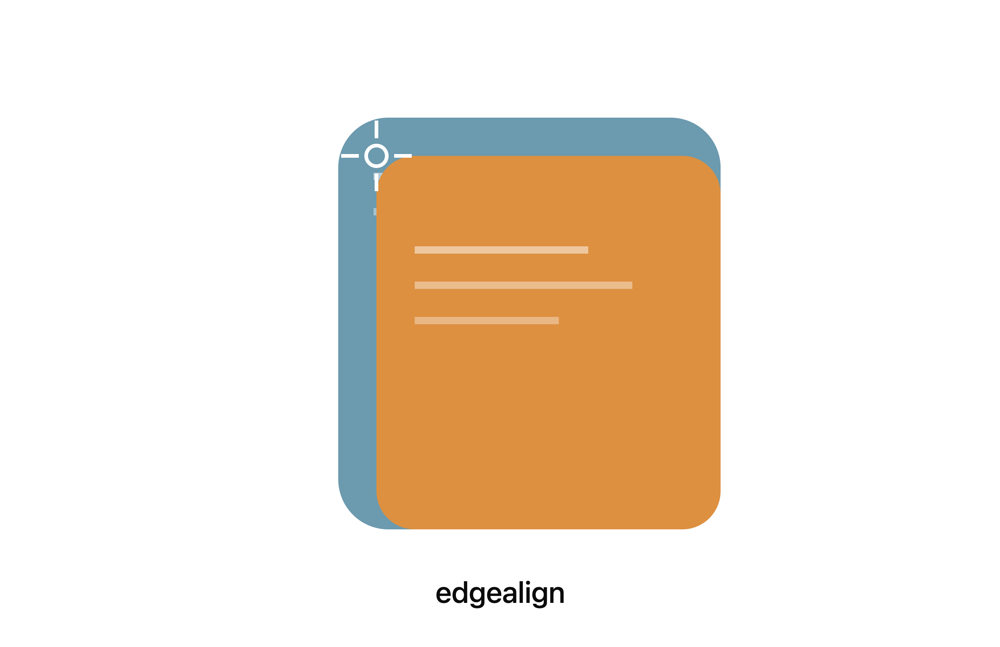

  

# EdgeAlign

EdgeAlign is a research project for a **soft prompt generator**: a small
trainable network that compresses a prompt (and optional context) into a
short sequence of "soft prompt" prefix vectors, prepended to the token
embeddings fed into a **frozen** LLM. The frozen LLM's weights are never
updated at any stage — only the generator learns.

## How it's trained

1. **Self-distillation warm start** — the generator is taught to produce
   soft prefixes that leave the frozen model's output distribution
   effectively unchanged versus running the plain prompt with no prefix at
   all. Loss is KL divergence between the teacher (no prefix) and student
   (soft prefix) output distributions; only the generator gets gradients.
2. **RL fine-tuning** (not yet specced in detail) — starting from the
   warm-start checkpoint, real agent tool-use task success/failure is used
   as a reward signal to further fine-tune the generator only.

The end goal: an on-device coding/tool-use agent where the soft prompt
generator adapts a frozen small LLM's behavior cheaply, without ever
fine-tuning the LLM itself.

## Deployment phases

- **Phase 1 — Prototype**: Qwen 3 32B dense, frozen, on server-class
  hardware (A100s). Priority: fast iteration, validating that the method
  works at all.
- **Phase 2 — Deploy**: Qwen 3 8B dense, frozen, quantized, on a real
  customer laptop (e.g. MacBook Air class, 16GB+ unified memory). Priority:
  memory footprint and inference speed. The generator is retrained from
  scratch against the 8B model, not ported from Phase 1.

## Architecture variants (three candidates, spec'd in `PROMPTS/`)

- **v1 — Baseline (separate encoder)** — a frozen BERT-family encoder reads
  the prompt/context, feeding a 3-layer MLP (128 units, GELU) that outputs
  the soft prompt vectors.
- **v2 — Self-embedding generator** — no separate encoder; reuses the
  frozen LLM's own hidden states (last three transformer layers before the
  final layer, concatenated and mean-pooled) as the generator's input. Costs
  two forward passes through the frozen LLM per example, in exchange for
  richer representations.
- **v3 — Linear attention / SSM encoder** — replaces the BERT-family
  encoder with a frozen linear-attention or state-space model encoder (e.g.
  Mamba), to remove the short fixed-context-length ceiling that
  full-attention encoders impose.

No variant has been chosen for implementation yet — see `PROMPTS/` for the
full specs, and `MEMORY.md` for a detailed summary and current project
state.

## Training data (pretraining stage)

Weighted toward English code and tool-use, not general web text:
[Stack-Edu](https://huggingface.co/datasets/HuggingFaceTB/stack-edu) (code
coverage), **OpenCodeInstruct** (paired instruction-and-code prompts), and
**xLAM** (tool-calling prompt shapes).

## Repo layout

- `PROMPTS/` — the source-of-truth spec documents for the generator
  architectures and training pipeline.
- `MEMORY.md` / `SHORT_MEMORY.md` / `AGENT.md` — the project's persistent
  memory and agent operating instructions (see those files for details).
